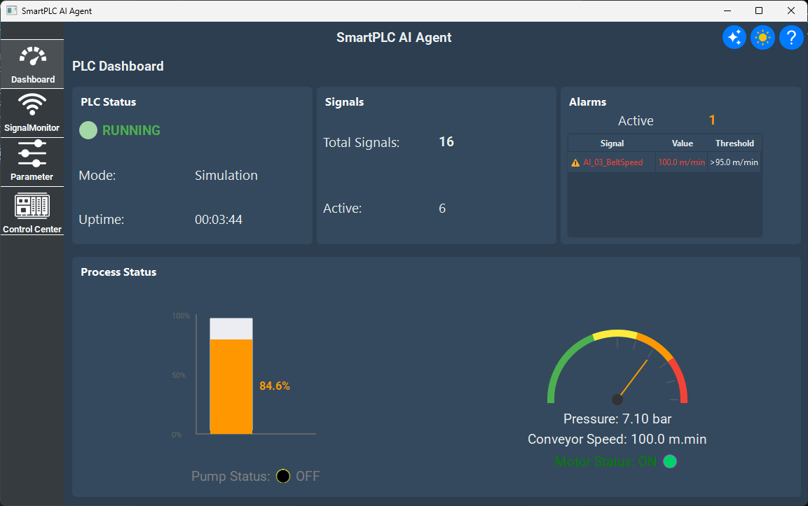
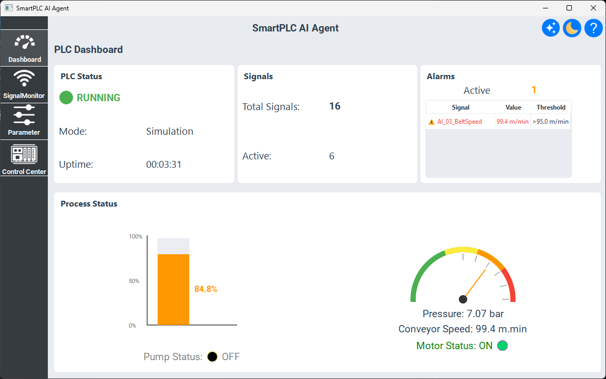
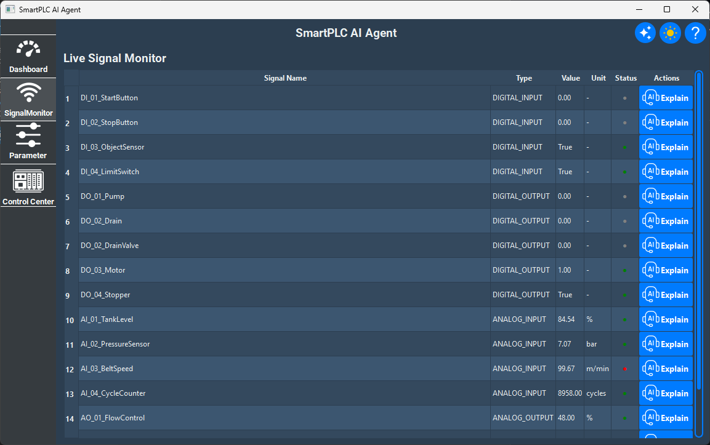
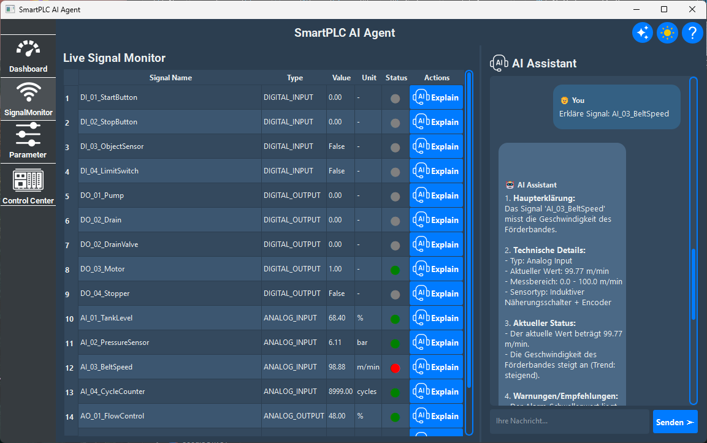
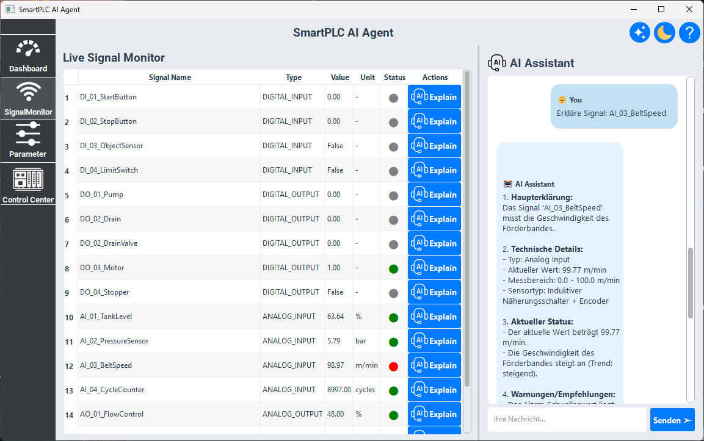
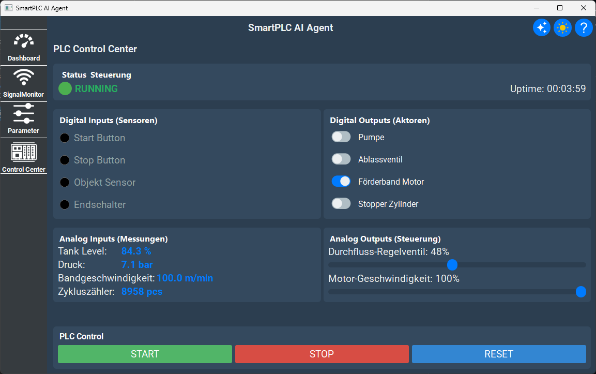

# SmartPLC AI Agent 🤖🏭

> **Intelligente PLC-Überwachung mit KI-gestütztem Support**

Ein modernes SCADA-System mit integriertem AI-Assistenten für industrielle Prozesssteuerung. Kombiniert PLC-Simulation, Echtzeit-Monitoring und RAG-basierte KI-Unterstützung.

[](https://www.python.org/)
[](https://www.qt.io/qt-for-python)
[](https://openai.com/)
[](docs/LICENSE)

---

## 📋 Inhaltsverzeichnis

- [Features](#-features)
- [Schnellstart](#-schnellstart)
- [Installation](#-installation)
- [Konfiguration](#-konfiguration)
- [Verwendung](#-verwendung)
- [Architektur](#-architektur)
- [Dokumentation](#-dokumentation)
- [Entwicklung](#-entwicklung)
- [Troubleshooting](#-troubleshooting)
- [Lizenz](#-lizenz)
- [Screenshots](#-screenshots)

---

## ✨ Features

### 🎯 **Core Features**
- ✅ **PLC-Simulation** - MockPLC mit realistischer Prozesslogik (Tank, Förderband)
- ✅ **Echtzeit-Monitoring** - Live-Dashboard mit Gauges, Charts und Signal-Monitor
- ✅ **AI-Assistant** - ChatGPT-3.5-Turbo mit RAG für technische Unterstützung
- ✅ **Alarm-System** - Automatische Schwellwertüberwachung mit Logging
- ✅ **Parameter-Editor** - Anpassbare Prozessparameter (Timer, Setpoints, Limits)
- ✅ **Database-Integration** - SQLAlchemy ORM mit SQLite (8 Tabellen)

### 🔧 **Technische Features**
- 📊 **Signal-History** - Zeit-Serien-Speicherung alle 5s
- 🧠 **RAG-Engine** - FAISS Vector Store mit Sentence Transformers
- 🎨 **Modernes UI** - PySide6 mit Dark/Light Theme
- 🔄 **Multi-Threading** - Asynchrone PLC-Simulation (500ms Update)
- 📝 **Logging** - Strukturiertes Logging mit Loguru
- 🐳 **Docker-Support** - Containerisierte Deployment

### 🏭 **PLC I/O (16 Signale)**
- **Digital Inputs (4):** StartButton, StopButton, ObjectSensor, LimitSwitch
- **Digital Outputs (5):** Pump, DrainValve, Motor, Stopper
- **Analog Inputs (4):** TankLevel (%), Pressure (bar), BeltSpeed (m/min), CycleCounter
- **Analog Outputs (3):** FlowControl (%), MotorSpeed (%), HeatingPower (%)

---

## 🚀 Schnellstart

### **1. Repository klonen**
```bash
git clone <repository-url>
cd SmartPLC_AI_Agent
```

### **2. Datenbank initialisieren** (nur einmal!)
```bash
# Windows:
setup_database.bat

# Linux/Mac:
python scripts/init_database.py
```

**Erstellt:**
- ✅ 8 Datenbank-Tabellen
- ✅ 16 PLC-Signale
- ✅ 12 Standard-Parameter
- ✅ 92 Knowledge-Base-Dokumente

### **3. API-Key konfigurieren**
```bash
# .env-Datei erstellen
copy .env.example .env

# API-Key eintragen (Notepad/VS Code)
notepad .env
```

Fügen Sie hinzu:
```env
OPENAI_API_KEY=sk-your-api-key-here
```

### **4. Anwendung starten**
```bash
# Windows:
start.bat

# Linux/Mac:
python main.py
```

**Fertig!** 🎉 Die GUI öffnet sich automatisch.

---

## 📦 Installation

### **Voraussetzungen**
- Python 3.8 oder höher
- pip (Python Package Manager)
- 2 GB freier Speicherplatz
- OpenAI API Key ([hier erhalten](https://platform.openai.com/api-keys))

### **Manuelle Installation**

#### **1. Virtuelle Umgebung erstellen**
```bash
# Windows
python -m venv venv
venv\Scripts\activate

# Linux/Mac
python3 -m venv venv
source venv/bin/activate
```

#### **2. Dependencies installieren**
```bash
pip install -r requirements.txt
```

**Hauptabhängigkeiten:**
- `PySide6>=6.8.0` - Qt GUI Framework
- `openai>=1.0.0` - OpenAI API Client
- `sqlalchemy>=2.0.0` - ORM für Datenbank
- `loguru>=0.7.0` - Logging
- `sentence-transformers>=2.2.0` - Embeddings für RAG
- `faiss-cpu>=1.7.4` - Vector Search
- `pyyaml>=6.0` - YAML-Konfiguration

#### **3. Datenbank vorbereiten**
```bash
python scripts/init_database.py
```

#### **4. Konfiguration**
```bash
# .env erstellen
copy .env.example .env

# API-Key eintragen
echo OPENAI_API_KEY=sk-your-key > .env
```

---

## ⚙️ Konfiguration

### **Umgebungsvariablen (.env)**
```env
# OpenAI API
OPENAI_API_KEY=sk-your-api-key-here
OPENAI_MODEL=gpt-3.5-turbo
OPENAI_TEMPERATURE=0.7

# Database
DATABASE_URL=sqlite:///data/db/plc_data.db

# Logging
LOG_LEVEL=INFO
LOG_FILE=data/logs/plc_studio.log

# RAG
RAG_MODEL=sentence-transformers/all-MiniLM-L6-v2
RAG_TOP_K=3
```

### **YAML-Konfiguration (config/config.yaml)**
```yaml
openai:
  model: "gpt-3.5-turbo"
  temperature: 0.7
  max_tokens: 2000

rag:
  model_name: "sentence-transformers/all-MiniLM-L6-v2"
  chunk_size: 512
  top_k: 3

plc:
  update_interval_ms: 500
  history_interval_s: 5

gui:
  window_title: "SmartPLC AI Agent"
  theme: "dark"
  window_size: [1400, 900]
```

---

## 🎮 Verwendung

### **1. Dashboard**
**Übersicht über PLC-Status:**
- 🟢 Live-Indikator (RUNNING/STOPPED)
- ⏱️ Uptime-Anzeige
- 📊 Signal-Statistiken (Total, Aktiv)
- 🚨 Aktive Alarme (Echtzeit)
- 📈 Prozess-Status (Tank-Level, Druck, Förderband)

### **2. Signal Monitor**
**Live-Signalüberwachung:**
- 📋 Tabelle mit allen 16 Signalen
- 🔴/🟢 Status-Indikatoren (Digital)
- 📊 Werte mit Einheiten (Analog)
- 🤖 **AI-Erklärung** pro Signal (Klick auf 🤖-Button)

**Beispiel:**
1. Klick auf 🤖 neben `AI_02_PressureSensor`
2. AI-Chat öffnet sich automatisch
3. Erklärung: *"Der Drucksensor misst den Systemdruck zwischen 0-10 bar. Aktuell: 4.2 bar. Normal-Bereich..."*

### **3. Parameter-Editor**
**Prozessparameter anpassen:**
- ⏲️ Timer (Motor Start Delay, Pump Runtime)
- 🎯 Setpoints (Tank Target Level, Pressure)
- ⚠️ Thresholds (Alarm-Schwellwerte)
- 💾 Änderungen werden sofort in DB gespeichert

### **4. PLC Control Center**
**Direkte I/O-Steuerung:**

**Digital Outputs:**
- ☑️ Pumpe (DO_01_Pump)
- ☑️ Ablassventil (DO_02_DrainValve)
- ☑️ Förderband Motor (DO_03_Motor)
- ☑️ Stopper Zylinder (DO_04_Stopper)

**Analog Outputs:**
- 🎚️ Durchfluss-Regelventil (0-100%)
- 🎚️ Motor-Geschwindigkeit (0-100%)

**Funktionen:**
- ▶️ Start PLC
- ⏹️ Stop PLC
- 🔄 Reset (setzt alle Ausgänge zurück)

### **5. AI-Chat**
**KI-gestützter Assistent:**

**Beispiel-Fragen:**
```
👤 "Erkläre Signal AI_01_TankLevel"
🤖 "Der Tank-Füllstand-Sensor (AI_01_TankLevel) misst den aktuellen 
    Füllstand im Tank von 0-100%. Typ: Ultraschall-Sensor. 
    Alarm bei 95%. Aktueller Wert: 42.3%..."

👤 "Was bedeutet Fehlercode E4401?"
🤖 "Fehlercode E4401: Drucksensor-Ausfall. Mögliche Ursachen:
    1. Sensor defekt
    2. Verkabelung unterbrochen
    3. Spannungsversorgung fehlt..."

👤 "Wie starte ich die Pumpe?"
🤖 "Um die Pumpe zu starten: 1. PLC Control Center öffnen, 
    2. Checkbox 'Pumpe' aktivieren, 3. Tank füllt sich automatisch..."
```

---

## 🏗️ Architektur

```
SmartPLC_AI_Agent/
├── 📁 config/              # Konfiguration
│   ├── config.py           # Python Config-Loader
│   └── config.yaml         # YAML Settings
├── 📁 core/                # Kernlogik
│   ├── data/               # Datenbank
│   │   └── database.py     # SQLAlchemy Models (8 Tabellen)
│   ├── llm/                # KI-Integration
│   │   ├── openai_client.py    # GPT-3.5 Client
│   │   └── rag_engine.py       # RAG mit FAISS
│   └── plc/                # PLC-Simulation
│       └── mock_plc.py     # MockPLC (580 Zeilen)
├── 📁 gui/                 # PySide6 GUI
│   ├── views/              # Hauptviews
│   │   ├── main_window.py      # Hauptfenster
│   │   ├── dashboard.py        # Dashboard
│   │   ├── signal_monitor.py   # Signal-Monitor
│   │   ├── parameter_editor.py # Parameter-Editor
│   │   └── plc_control.py      # PLC Control Center
│   ├── widgets/            # Custom Widgets
│   │   ├── ai_chat.py          # AI-Chat-Widget
│   │   ├── GaugeWidget.py      # Druck-Anzeige
│   │   ├── BarChartWidget.py   # Tank-Balken
│   │   └── LiveIndicator.py    # Live-Status
│   └── themes/             # QSS Stylesheets
│       ├── dark.qss
│       └── light.qss
├── 📁 scripts/             # Setup & Tools
│   ├── init_database.py    # DB-Setup (komplett)
│   ├── init_signals.py     # Signal-Initialisierung
│   ├── init_parameters.py  # Parameter-Setup
│   ├── init_knowledge_base.py  # RAG Knowledge Base
│   └── setup_database.bat  # Windows Installer
├── 📁 knowledge_base/      # RAG-Dokumente
│   ├── error_codes.md
│   ├── faqs/
│   │   └── common_questions.md
│   └── manuals/
│       └── signal_documentation.md
├── 📁 data/                # Runtime Data
│   ├── db/                 # SQLite DB
│   ├── logs/               # Log-Dateien
│   └── vector_store/       # FAISS Vector Store (RAG)
├── 📁 docs/                # Dokumentation
│   ├── ARCHITECTURE.md
│   ├── INSTALLATION.md
│   ├── QUICKSTART.md
│   └── DATABASE_SETUP.md
├── main.py                 # Einstiegspunkt
├── requirements.txt        # Dependencies
├── setup_database.bat      # DB-Setup
└── start.bat               # App-Starter

```

### **Datenbank-Schema (8 Tabellen)**

```sql
-- Projekte
CREATE TABLE projects (
    id INTEGER PRIMARY KEY,
    name VARCHAR(200) UNIQUE NOT NULL,
    description TEXT,
    is_active BOOLEAN DEFAULT TRUE
);

-- PLC-Signale (16 Einträge)
CREATE TABLE signals (
    id INTEGER PRIMARY KEY,
    project_id INTEGER REFERENCES projects(id),
    name VARCHAR(200) NOT NULL,
    type VARCHAR(50) NOT NULL,  -- DI, DO, AI, AO
    address VARCHAR(50),         -- %IX0.0, %QW1
    current_value FLOAT,
    unit VARCHAR(20),            -- %, bar, m/min
    alarm_threshold FLOAT,
    warning_threshold FLOAT
);

-- Signal-Historie (Zeit-Serien)
CREATE TABLE signal_history (
    id INTEGER PRIMARY KEY,
    signal_id INTEGER REFERENCES signals(id),
    timestamp DATETIME NOT NULL,
    value FLOAT NOT NULL
);

-- Parameter (12 Einträge)
CREATE TABLE parameters (
    id INTEGER PRIMARY KEY,
    project_id INTEGER REFERENCES projects(id),
    name VARCHAR(200) NOT NULL,
    category VARCHAR(100),       -- timer, setpoint, threshold
    value FLOAT NOT NULL,
    min_value FLOAT,
    max_value FLOAT
);

-- Alarm-Log
CREATE TABLE alarm_logs (
    id INTEGER PRIMARY KEY,
    timestamp DATETIME NOT NULL,
    signal_name VARCHAR(200),
    alarm_type VARCHAR(50),      -- warning, critical
    severity VARCHAR(20),         -- low, medium, high
    message TEXT,
    acknowledged BOOLEAN DEFAULT FALSE
);

-- Chat-Historie
CREATE TABLE chat_history (
    id INTEGER PRIMARY KEY,
    timestamp DATETIME NOT NULL,
    role VARCHAR(20),            -- user, assistant, system
    content TEXT NOT NULL,
    context_signal VARCHAR(200),
    prompt_tokens INTEGER,
    completion_tokens INTEGER
);

-- Signal-Dokumentation
CREATE TABLE signal_documentation (
    id INTEGER PRIMARY KEY,
    signal_id INTEGER REFERENCES signals(id),
    doc_type VARCHAR(50),        -- manual, datasheet, note
    title VARCHAR(200),
    content TEXT NOT NULL,
    doc_id VARCHAR(100)          -- FAISS Document ID (hash)
);

-- Benutzer-Einstellungen
CREATE TABLE user_settings (
    id INTEGER PRIMARY KEY,
    user_name VARCHAR(100) UNIQUE,
    theme VARCHAR(20) DEFAULT 'light',
    role VARCHAR(50) DEFAULT 'operator',
    can_write_plc BOOLEAN DEFAULT FALSE
);
```

---

## 📚 Dokumentation

### **Verfügbare Dokumente**
- 📘 **[ARCHITECTURE.md](docs/ARCHITECTURE.md)** - System-Architektur & Design
- 📗 **[INSTALLATION.md](docs/INSTALLATION.md)** - Detaillierte Installationsanleitung
- 📙 **[QUICKSTART.md](docs/QUICKSTART.md)** - 3-Minuten Schnellstart
- 📕 **[DATABASE_SETUP.md](docs/DATABASE_SETUP.md)** - Datenbank-Setup & Schema
- 📔 **[CONTRIBUTING.md](docs/CONTRIBUTING.md)** - Entwickler-Guidelines

### **API-Dokumentation**
```bash
# Generiere Code-Dokumentation
pip install pdoc3
pdoc --html --output-dir docs/api core gui
```

---

## 🛠️ Entwicklung

### **Projekt-Setup**
```bash
# Repository klonen
git clone <url>
cd SmartPLC_AI_Agent

# Venv erstellen
python -m venv venv
source venv/bin/activate  # Windows: venv\Scripts\activate

# Dev-Dependencies
pip install -r requirements.txt
pip install pytest black flake8 mypy

# Pre-commit Hooks
pip install pre-commit
pre-commit install
```

### **Tests ausführen**
```bash
# Alle Tests
pytest

# Mit Coverage
pytest --cov=core --cov=gui

# Spezifischer Test
pytest tests/test_database.py -v
```

### **Code-Qualität**
```bash
# Formatierung
black .

# Linting
flake8 core gui

# Type-Checking
mypy core
```

### **Neue Features entwickeln**
1. Feature-Branch erstellen: `git checkout -b feature/my-feature`
2. Code schreiben + Tests hinzufügen
3. Code-Qualität prüfen: `black . && flake8`
4. Tests ausführen: `pytest`
5. Commit + Push
6. Pull Request erstellen

---

## 🐛 Troubleshooting

### **Problem: PySide6 Import Error**
```bash
# Lösung: PySide6 neu installieren
pip uninstall PySide6
pip install PySide6>=6.8.0
```

### **Problem: OpenAI API Error (401 Unauthorized)**
```bash
# Prüfen: API-Key in .env korrekt?
cat .env | grep OPENAI_API_KEY

# Prüfen: Guthaben auf OpenAI-Account?
# → https://platform.openai.com/account/usage
```

### **Problem: Database Locked**
```bash
# Lösung: Alle DB-Zugriffe schließen
# 1. App beenden
# 2. Journal löschen
del data\db\plc_data.db-journal
# 3. App neu starten
```

### **Problem: RAG Knowledge Base fehlt**
```bash
# Lösung: Knowledge Base neu initialisieren
python scripts/init_knowledge_base.py
```

### **Problem: Signale nicht in DB**
```bash
# Lösung: Datenbank zurücksetzen
del data\db\plc_data.db
python scripts/init_database.py
```

### **Logs prüfen**
```bash
# Neueste Log-Datei öffnen
ls -lt data/logs/ | head -1
cat data/logs/plc_studio_*.log
```

---

## 📄 Lizenz

MIT License - siehe [LICENSE](docs/LICENSE) für Details.

---

## 👥 Autoren

- **SmartPLC Team** - Entwicklung & Wartung

---

## 🙏 Danksagungen

- **PySide6** - Qt for Python GUI Framework
- **OpenAI** - GPT-3.5-Turbo API
- **Sentence Transformers** - Embedding-Modelle
- **FAISS** - Vector Search Engine
- **SQLAlchemy** - ORM Framework
- **Loguru** - Logging-Library

---

## 📞 Support

**Probleme melden:**
- 🐛 [GitHub Issues](https://github.com/Osamaiqji89/SmartPLC_AI_Agent/issues)

**Dokumentation:**
- 📚 [Dokumentation](docs/)
- 📖 [Architektur](docs/ARCHITECTURE.md)
- 🐳 [Docker Setup](docs/DOCKER.md)

---

## 📷 Screenshots

Hier sind einige Screenshots der Anwendung:

### Dashboard (Dark Mode)


### Dashboard (Light Mode)


### Parameter Editor


### Signal Monitor


### Signal Chat (Dark Mode)


### Signal Chat (Light Mode)


### Control Center


---

**Made with ❤️ for Industrial Automation**
